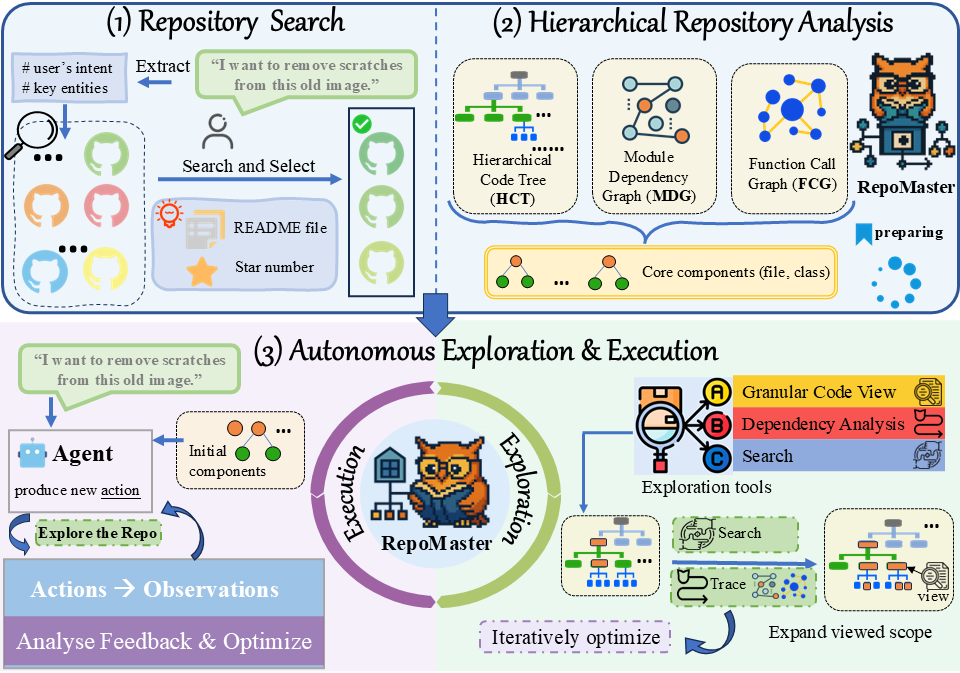

<div align="center">


</div>

# RepoMaster: Autonomous Exploration and Understanding of GitHub Repositories for Complex Task Solving

<div align="center">

[](https://www.python.org/)
[](LICENSE)
[](https://github.com/wanghuacan/RepoMaster)

[English](README.md) | [中文](README_CN.md)

</div>

> **📢 Important Notice**: The complete source code will be open-sourced after paper publication. Currently, we provide project demonstrations and partial code examples.

## 🎯 Quick Demo

Imagine describing a task in natural language, and RepoMaster automatically handles the rest: from finding the most suitable GitHub repository and understanding its complex code structure, to finally executing and completing the task! RepoMaster can handle everything from simple data extraction to complex AI model applications.

**For example, you could tell RepoMaster:**

-   **Simple Tasks**:
    -   "Help me scrape all product names and prices from this webpage."
    -   "Extract all table data from this PDF document and save it as a CSV file."
-   **Complex Tasks**:
    -   "Transform this portrait photo into the style of a Van Gogh oil painting." (As demonstrated below)
    -   "Automatically edit this long video, extract all exciting clips featuring a specific person, and add background music."
    -   "Process this meeting recording, separate different speakers' voices, generate meeting minutes, and extract key action items."

### 🎨 Neural Style Transfer Task Demo (Complex Task Example)

<table>
<tr>
<td align="center"><b>Original Image</b></td>
<td align="center"><b>Style Reference</b></td>
<td align="center"><b>Transfer Result</b></td>
</tr>
<tr>
<td></td>
<td></td>
<td></td>
</tr>
</table>

**RepoMaster Automated Workflow (Style Transfer Example)**:
1. 🔍 **Smart Search**: Automatically search for style transfer related repositories on GitHub.
2. 🏗️ **Structure Analysis**: Analyze repository code structure, identify core models and processing pipelines.
3. 🔧 **Autonomous Execution**: Automatically configure environment, load models, and process images.
4. ✅ **Task Completion**: Generate style-transferred images without human intervention.

<! ### 🎬 Complete Execution Demo (Style Transfer)>

<!-- 备用YouTube链接 -->
<p><strong>🎬 <a href="https://www.youtube.com/watch?v=Kva2wVhBkDU">### Watch how RepoMaster autonomously completes complex neural style transfer tasks:</a></strong></p>

<div align="center">


*Complete process of RepoMaster autonomously executing neural style transfer task*

</div>

**Demo Highlights**:
- 🤖 **Zero Human Intervention**: Fully automated from task understanding to result generation
- 🧠 **Intelligent Understanding**: Automatically comprehends complex deep learning codebases
- ⚡ **Efficient Execution**: Quickly locates key code, avoiding irrelevant exploration
- 🎯 **Precise Results**: High-quality task completion effects

---

## 🚀 Overview

RepoMaster is a revolutionary autonomous agent framework specifically designed to explore, understand, and utilize GitHub repositories for solving complex real-world tasks. Unlike traditional approaches that generate code from scratch, RepoMaster treats open-source repositories on GitHub as composable tool modules, automatically leveraging these resources through intelligent search, hierarchical analysis, and autonomous exploration.

### 🎨 Illustration of RepoMaster Framework



### 🎯 Core Philosophy

- **Repositories as Tools**: Treat open-source repositories as pre-built toolkits for solving complex tasks
- **Human-like Exploration**: Mimic how human programmers explore unfamiliar codebases
- **Smart Compression**: Efficiently manage massive code information within limited LLM context windows
- **Autonomous Execution**: End-to-end completion from task understanding to code execution


## 📊 Performance Results

### GitTaskBench Evaluation

| Framework | LLM | Execution Completion Rate | Task Pass Rate | Token Usage |
|-----------|-----|---------------------------|----------------|-------------|
| SWE-Agent | Claude 3.5 | 44.44% | 14.81% | 330k |
| OpenHands | Claude 3.5 | 48.15% | 24.07% | 3094k |
| **RepoMaster** | **Claude 3.5** | **75.92%** | **62.96%** | **154k** |

### MLE-Bench Evaluation

Note: MLE-Bench-R consists of 22 Kaggle competition tasks, all drawn from MLE-Bench and nearly identical to those in MLE-Bench-Lite. Unlike the original MLE-Bench, however, tasks in MLE-Bench-R require you to find GitHub repositories that can solve each problem and to understand and leverage their code—rather than writing entirely new solutions from scratch—to complete and submit your results.

| Framework | LLM | Valid Submission Rate | Medal Rate | Gold Medal Rate |
|-----------|-----|----------------------|------------|-----------------|
| SWE-Agent | Claude 3.5 | 50.00% | 4.55% | 4.55% |
| OpenHands | Claude 3.5 | 45.45% | 4.55% | 4.55% |
| **RepoMaster** | **Claude 3.5** | **95.45%** | **27.27%** | **22.73%** |


## ✨ Key Features

### 🔍 Intelligent Repository Search
- Deep search algorithms based on task descriptions
- Multi-round query optimization and repository quality assessment
- Automated repository relevance analysis

### 🏗️ Hierarchical Repository Analysis
- **Hybrid Structural Modeling**: Build Hierarchical Code Trees (HCT), Function Call Graphs (FCG), and Module Dependency Graphs (MDG)
- **Core Component Identification**: Automatically identify key modules, classes, and functions based on importance scoring
- **Context Initialization**: Intelligently construct initial context containing README, module summaries, and core code

### 🔧 Autonomous Exploration & Execution
- **Granular Code View**: Support file, class, and function-level code inspection
- **Dependency Analysis**: Trace call chains and dependency paths
- **Smart Search**: Keyword matching and semantic search
- **Context-aware Information Selection**: Multi-level content compression strategies

### 💡 Core Advantages
- **Efficiency**: 95% reduction in token consumption compared to existing frameworks
- **Accuracy**: Improve task pass rate from 24.1% to 62.9% on GitTaskBench
- **Universality**: Support multiple LLM backends (GPT-4o, Claude-3.5, DeepSeek-V3)
- **Extensibility**: Modular design supporting custom tools and extensions


## 🚀 Quick Start

### Installation Requirements

```bash
# Python 3.11+
pip install -r requirements.txt
```

### 🎯 Single-Prompt Driven Automated Task Solving

The core appeal of RepoMaster lies in its powerful autonomy. You simply provide a task described in natural language, and `RepoMasterAgent` initiates its complex internal workflow to handle everything that follows. This is not just about executing a predefined script; it's a dynamic, intelligent process of exploration and problem-solving.

**When you execute `repo_master.solve_task_with_repo(task)`, RepoMaster might perform the following operations behind the scenes:**

1.  **Task Understanding & Intelligent Search**:
    *   Parses your natural language task (e.g., "Transform this image into Van Gogh style").
    *   Automatically searches for the most relevant open-source projects on platforms like GitHub.
    *   Evaluates and filters to select the most suitable code repository as a basis for solving the problem.

2.  **In-depth Code Comprehension & Planning**:
    *   Clones the selected repository and performs a hierarchical structural analysis (reading README, parsing code structure, identifying core modules, functions, etc.).
    *   Develops a detailed, multi-step execution plan based on task requirements and repository characteristics.

3.  **Autonomous Execution & Dynamic Adaptation**:
    *   **Environment Preparation**: Automatically handles dependency installation, data path configuration, etc.
    *   **Code Execution**: Runs key scripts identified from the repository or generates new glue code.
    *   **Intelligent Trial-and-Error & Debugging**:
        *   Monitors the execution process, capturing errors and warnings (e.g., `NameError`, `FileNotFoundError`, numerical instability like `NaN` loss).
        *   Autonomously diagnoses the cause of issues based on error messages (e.g., missing imports, improper parameters, incorrect file paths).
        *   Dynamically adjusts the execution strategy (e.g., modifying scripts, adjusting hyperparameters, changing optimizers, searching for correct filenames).
    *   **Iterative Optimization**: Multiple attempts until the task is successfully executed or a preset attempt limit is reached.

4.  **Result Consolidation & Delivery**:
    *   Collects execution results and saves them to the specified location or format.
    *   Reports task completion status and final output to the user.

**Basic Usage Example (Neural Style Transfer):**

```python
from core.agent_scheduler import RepoMasterAgent

# Initialize RepoMaster
llm_config = {
    "config_list": [{
        "model": "claude-3-5-sonnet-20241022",
        # "api_key": "your_api_key", # Please replace with your API Key
        # "base_url": "https://api.anthropic.com" # Please replace with your API Endpoint
    }],
    "timeout": 2000,
    "temperature": 0.1,
}

code_execution_config = {
    "work_dir": "workspace", 
    "use_docker": False
}

repo_master = RepoMasterAgent(
    llm_config=llm_config,
    code_execution_config=code_execution_config,
)

# Define a complex AI task
task = """
I need to transfer the style of an artwork to a content image.
Content image path: 'example/origin.jpg'
Style reference image path: 'example/style.jpg'
Please save the final stylized image as 'workspace/merged_styled_image.png'
"""

# User initiates the task with a single line of code
# RepoMaster will autonomously handle the entire process of search, understanding, execution, and debugging
result_summary = repo_master.solve_task_with_repo(task)

print("Task Completion Summary:")
print(result_summary)
```

The `task` string in the code above is the core of your interaction with RepoMaster. RepoMaster will parse this natural language task and, like an experienced developer, autonomously find resources, write or adjust code, handle issues encountered during the process, and finally deliver the results.

### Advanced Usage

#### 1. Using Specific Repository

```python
from core.git_task import TaskManager, AgentRunner

# Construct task configuration
task_info = {
    "repo": {
        "type": "github",
        "url": "https://github.com/spatie/pdf-to-text",
    },
    "task_description": "Extract PDF text content",
    "input_data": [
        {
            "path": "/path/to/input.pdf",
            "description": "PDF file to process"
        }
    ],
}

# Execute task
result = AgentRunner.run_agent(task_info)
```

#### 2. Local Repository Analysis

```python
from core.git_agent import CodeExplorer

# Initialize code explorer
explorer = CodeExplorer(
    local_repo_path="/path/to/local/repo",
    work_dir="workspace",
    task_type="general",
    use_venv=True,
    llm_config=llm_config
)

# Execute code analysis
task = "Analyze the core functionality of this repository and generate usage examples"
result = explorer.code_analysis(task)
```

## 🛠️ Core Components

### 1. Repository Search Module (`deep_search.py`)

```python
async def github_repo_search(self, task):
    """
    Execute GitHub repository deep search
    
    Args:
        task: Task description
        
    Returns:
        JSON list of matching repositories
    """
```

### 2. Code Exploration Tool (`git_agent.py`)

```python
class CodeExplorer:
    """
    Core code exploration and analysis tool
    
    Main features:
    - Repository structure analysis
    - Dependency relationship building  
    - Smart code navigation
    - Task-driven code generation
    """
```

### 3. Task Manager (`git_task.py`)

```python
class TaskManager:
    """
    Task initialization, environment preparation and execution management
    
    Main features:
    - Work environment creation
    - Dataset copying and processing
    - Task configuration management
    """
```

## 📋 Configuration

### LLM Configuration

```python
llm_config = {
    "config_list": [
        {
            "model": "gpt-4o",  # Supported: gpt-4o, claude-3-5-sonnet, deepseek-chat
            "api_key": "your_api_key",
            "base_url": "api_endpoint"
        }
    ],
    "timeout": 2000,
    "temperature": 0.1,
}
```

### Code Execution Configuration

```python
code_execution_config = {
    "work_dir": "workspace",      # Working directory
    "use_docker": False,          # Whether to use Docker
    "timeout": 7200,              # Execution timeout (seconds)
}
```

### Explorer Configuration

```python
explorer_config = {
    "max_turns": 40,              # Maximum conversation turns
    "use_venv": True,             # Whether to use virtual environment
    "function_call": True,        # Whether to enable function calls
    "repo_init": True,            # Whether to perform repository initialization analysis
}
```

## 🔧 Custom Extensions

### Adding Custom Tools

```python
from util.toolkits import register_toolkits

def custom_analysis_tool(file_path: str) -> str:
    """Custom analysis tool"""
    # Implement your analysis logic
    return analysis_result

# Register tool
register_toolkits(
    [custom_analysis_tool],
    scheduler_agent,
    user_proxy_agent,
)
```

### Extending Repository Search

```python
class CustomRepoSearcher:
    def __init__(self):
        self.search_strategies = [
            "keyword_based",
            "semantic_search", 
            "dependency_analysis"
        ]
    
    def search_repositories(self, task_description):
        # Implement custom search logic
        pass
```

## 📖 Experiments & Evaluation

### Reproducing Results

```bash
# Evaluate on GitTaskBench
python -m core.git_task --config configs/gittaskbench.yaml

# Evaluate on MLE-Bench  
python -m core.git_task --config configs/mle_r.yaml
```

## 🎬 Demo Videos

We provide detailed demo videos showing how RepoMaster:
- Automatically searches and selects relevant repositories
- Intelligently analyzes complex code structures
- Autonomously executes multi-step tasks
- Handles errors and iterative optimization

**🎨 Neural Style Transfer Demo**: See the [Quick Demo](#-quick-demo) section to watch how RepoMaster autonomously completes complex neural style transfer tasks.

**🎯 More Demos**: Additional demo videos across various domains will be released along with the project open-source.

## 📝 Use Cases

### Case 1: PDF Text Extraction

```python
task = """
Extract all text content from the first page of a PDF and save to a txt file.
Input file: /path/to/document.pdf
Output requirement: Save as output.txt
"""

result = repo_master.solve_task_with_repo(task)
# RepoMaster will automatically:
# 1. Search for PDF processing related repositories
# 2. Analyze repository structure and APIs
# 3. Generate extraction code
# 4. Execute and save results
```

### Case 2: Machine Learning Pipeline

```python
task = """
Train an image classification model based on the given image dataset.
Dataset: /path/to/image_dataset/
Requirements: Use pre-trained model for fine-tuning, save best model
"""

result = repo_master.solve_task_with_repo(task)
# RepoMaster will automatically:
# 1. Find suitable deep learning repositories
# 2. Understand data loading and model structure
# 3. Set up training pipeline
# 4. Execute training and save model
```

### Case 3: Video Processing

```python
task = """
Extract key frames from video and perform 3D pose estimation.
Input: /path/to/video.mp4  
Output: 3D joint coordinates JSON file
"""

result = repo_master.solve_task_with_repo(task)
# RepoMaster will automatically:
# 1. Search for video processing and pose estimation repositories
# 2. Understand preprocessing and inference workflow
# 3. Implement end-to-end processing pipeline
# 4. Generate structured output
```

## 🤝 Contributing

We welcome community contributions! Please refer to the following guidelines:

### Development Setup

```bash
git clone https://github.com/your-org/RepoMaster.git
cd RepoMaster
pip install -e ".[dev]"
pre-commit install
```

### Contribution Types

- 🐛 Bug fixes
- ✨ New feature development
- 📚 Documentation improvements
- 🧪 Test case additions
- 🔧 Tools and utilities

### Submission Process

1. Fork the project and create a feature branch
2. Write code and tests
3. Ensure all tests pass
4. Submit Pull Request

## 📄 License

This project is licensed under the MIT License - see the [LICENSE](LICENSE) file for details.

## 📚 Citation

If you use RepoMaster in your research, please cite our paper:


## 🙏 Acknowledgments

Thanks to the following projects and communities for inspiration and support:
- [AutoGen](https://github.com/microsoft/autogen) - Multi-agent conversation framework
- [OpenHands](https://github.com/All-Hands-AI/OpenHands) - Software engineering agent platform  
- [SWE-Agent](https://github.com/princeton-nlp/SWE-agent) - GitHub issue solving agent
- [MLE-Bench](https://github.com/openai/mle-bench) - Machine learning engineering benchmark

## 📞 Contact Us

- 📧 Email: [wanghuacan17@mails.ucas.ac.cn]
- 🐛 Issues: [GitHub Issues](https://github.com/wanghuacan/RepoMaster/issues)
- 💬 Discussions: [GitHub Discussions](https://github.com/wanghuacan/RepoMaster/discussions)

---

<div align="center">

**⭐ If RepoMaster helps you, please give us a star!**

Made with ❤️ by the RepoMaster Team

</div> 
